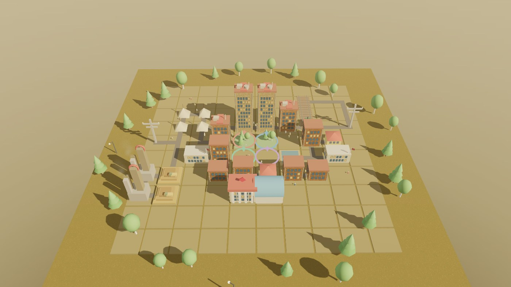

# Строим Гай 🏗️

**Две браузерные игры для Гайского историко-краеведческого музея** — о том, как в 1959 году в голой оренбургской степи родился город горняков.



Игры сделаны для музейных мероприятий с детьми 6–14 лет: большой экран/проектор, до 4 геймпадов, ведущий-экскурсовод. Работают **полностью офлайн** — каждая игра это один самодостаточный HTML-файл, который открывается двойным кликом.

---

## 🎮 Игра 1 — «Комсомольская ударная. Строим Гай»

Кооперативный 3D-градостроитель на **1–4 игроков**. Дети вместе проходят реальную историю города — 7 этапов, от палаточного городка до памятника строителям:

**палатки → шахта и карьер → свет, железная дорога и пруд → дома растут ввысь → школы и детсады → дворцы культуры и спорта → память города**

- 🚧 у каждого этапа — чек-лист целей, а общая цель — **заселить 1000 жителей**
- 🛣️ **дороги прокладываются сами** между зданиями — город растёт на глазах
- 🚂 железная дорога строится в линию, и по ней **ездит паровозик**
- 👥 из построенных домов **выходят жители** и гуляют по улицам
- 📸 на смене этапа — **архивное фото** из фондов музея + историческая справка
- 🏆 в финале — статистика города и вклад каждого игрока

Вся 3D-графика — **процедурная** (three.js): здания, деревья, дым из труб, фигура шахтёра на памятнике. Ни одного внешнего ассета.

## ⭐ Игра 2 — «Большое путешествие по маленькому городу»

Командная викторина: **2 команды = 2 геймпада**, ведущий задаёт темп. **41 вопрос** об истории Гая и творчестве Ю. Г. Шевцова — с настоящими архивными фотографиями:

- вопрос + фото + 4 варианта (А/Б/В/Г)
- команды отвечают кнопками, за правильный ответ — **звёздочки** (красные и жёлтые)
- правильный ответ подсвечивается, счёт на экране, в финале — победитель

## 🚀 Запуск

```
Двойной клик по gay-stroika-prototype.html или viktorina.html. Всё.
```

Интернет не нужен вообще: three.js локально, шрифты вшиты base64, звук синтезируется через Web Audio прямо в браузере.

**Режим киоска** (полный экран + автозапуск + автоперезапуск):
- Windows: `kiosk\start-kiosk.bat` (+ `install-autostart-windows.bat` для автозапуска)
- Linux/Astra: `kiosk/start-kiosk.sh` (+ `install-autostart.sh`)

Управление: геймпады Xbox (Bluetooth) подключаются автоматически — стик, кнопка **A**, бамперы **LB/RB**. Есть резервная клавиатура для отладки (см. `docs/`).

## 🧱 Технологии

| | |
|---|---|
| 3D | three.js r128, процедурная генерация, PBR + IBL-окружение, «золотой час» |
| Графика-финт | canvas-текстуры фасадов, PMREM из процедурного неба, CSS-виньетка с зерном |
| Звук | Web Audio API — эффекты и амбиент синтезируются, аудиофайлов нет |
| Ввод | Gamepad API (до 4 XInput) + клавиатура по `e.code` (не зависит от раскладки) |
| Зависимости | ноль. Один HTML-файл на игру |

## 📂 Структура

```
gay-stroika-prototype.html   ← игра-стройка (вся игра в одном файле)
viktorina.html               ← викторина (вся игра в одном файле)
libs/three.min.js            ← three.js локально
foto/                        ← архивные фото музея (вопросы + этапы)
kiosk/                       ← киоск-скрипты Windows/Linux + автозапуск
docs/                        ← инструкция по установке и руководства
build-delivery.sh            ← сборка папок поставки по контрактам
fonts/inject_fonts.py        ← вшивание шрифтов base64 (для пересборки)
```

## 📜 Права

Создано по заказу МБУК «Гайский историко-краеведческий музей» (г. Гай, Оренбургская обл.).
Код — © 2026 Родион Тазетдинов. Архивные фотоматериалы — © Гайский историко-краеведческий музей.
